<h1 align="center">Olá, eu sou Gabrielle Christie 👋</h1>

Estudante de Análise e Desenvolvimento de Sistemas, desenvolvendo projetos práticos com foco em APIs REST, bancos de dados e aplicações web.

---

## `{ sobre_mim }`

- 🎓 Estudante de Análise e Desenvolvimento de Sistemas
- 💻 Foco em desenvolvimento Backend e Full Stack
- 🧠 Interesse em lógica, APIs REST e bancos de dados
- 🚀 Construindo projetos para aplicar conhecimentos na prática
- 📚 Estudando Python, JavaScript, Node.js e desenvolvimento web
- 🎯 Buscando minha primeira oportunidade na área de tecnologia

---

## `{ projetos_em_destaque }`

<table>
<tr>
<td width="50%" valign="top">
<h3 align="center"><a href="https://github.com/gabriellechristie-dev/Agendamento-Quadras-Esportivas-DFS-2026.2">🏟️ Agendamento de Quadras</a></h3>

API REST desenvolvida em equipe para gerenciamento de jogadores, quadras esportivas e reservas.

<strong>Principais recursos:</strong> autenticação, usuários, quadras, reservas e prevenção de conflitos de horários.

</td>
<td width="50%" valign="top">
<h3 align="center"><a href="https://github.com/gabriellechristie-dev/sistema-financeiro">💰 Sistema Financeiro</a></h3>

Sistema para gerenciamento de contas, receitas, despesas, categorias e metas financeiras.

<strong>Etapa atual:</strong> requisitos, regras de negócio, documentação e modelagem do banco de dados.

</td>
</tr>
<tr>
<td colspan="2" valign="top">
<h3 align="center"><a href="https://github.com/gabriellechristie-dev/sistema-acaiteria">🍧 Sistema da Açaiteria</a></h3>

Sistema para gerenciamento de clientes, produtos, tamanhos, adicionais, pedidos, pagamentos e faturamento de uma açaiteria.

<strong>Etapa atual:</strong> requisitos, regras de negócio e modelagem do banco de dados.

</td>
</tr>
</table>

 

<strong>🏟️ Agendamento de Quadras — ver detalhes</strong>

 
<ul>
<li>Projeto desenvolvido em equipe durante o bootcamp Full Stack.</li>
<li>API REST para gerenciamento de jogadores, quadras e reservas.</li>
<li>Autenticação e autorização utilizando JWT.</li>
<li>Banco de dados PostgreSQL utilizando Prisma ORM.</li>
<li>Prevenção de reservas em horários conflitantes.</li>
<li>Testes automatizados com Jest e Supertest.</li>
</ul>

 

<strong>💰 Sistema Financeiro — ver detalhes</strong>

 
<ul>
<li>Projeto individual Full Stack.</li>
<li>Gerenciamento de contas, receitas e despesas.</li>
<li>Organização das movimentações por categorias.</li>
<li>Criação e acompanhamento de metas financeiras.</li>
<li>Modelagem do banco de dados com PostgreSQL.</li>
<li>Backend planejado com Python e FastAPI.</li>
<li>Frontend planejado com React.</li>
</ul>

 

<strong>🍧 Sistema da Açaiteria — ver detalhes</strong>

 
<ul>
<li>Projeto individual para gerenciamento de uma açaiteria.</li>
<li>Cadastro de clientes, produtos, tamanhos e adicionais.</li>
<li>Gerenciamento de pedidos e pagamentos.</li>
<li>Controle de faturamento.</li>
<li>Modelagem do banco de dados com MySQL.</li>
<li>Backend planejado com Node.js, Express e Prisma.</li>
<li>Frontend planejado com React.</li>
</ul>

---

## `{ tecnologias }`

<h3 align="center">Linguagens e desenvolvimento</h3>

<h3 align="center">Bancos de dados e ferramentas</h3>

<h3 align="center">Em aprendizado</h3>

---

## `{ github_analytics }`

---

## `{ atualmente }`

- 📚 Estudando desenvolvimento Backend e Full Stack
- 🧩 Praticando lógica e resolução de problemas
- 🗃️ Trabalhando com bancos de dados relacionais
- 🔌 Criando e testando APIs REST
- 🎯 Buscando uma oportunidade de estágio em tecnologia

---

## `{ conecte_se_comigo }`

<strong>Disponível para oportunidades de estágio em desenvolvimento de software.</strong>

---

Gabrielle Christie · Desenvolvedora Backend e Full Stack em formação

